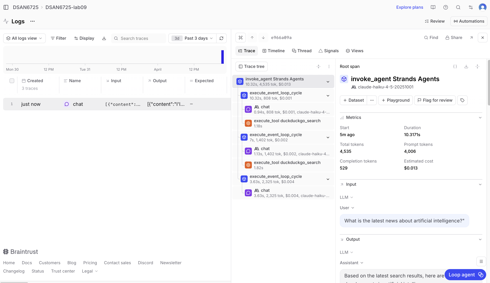
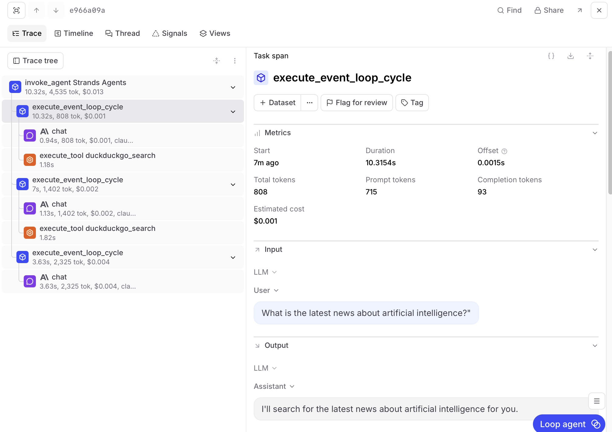
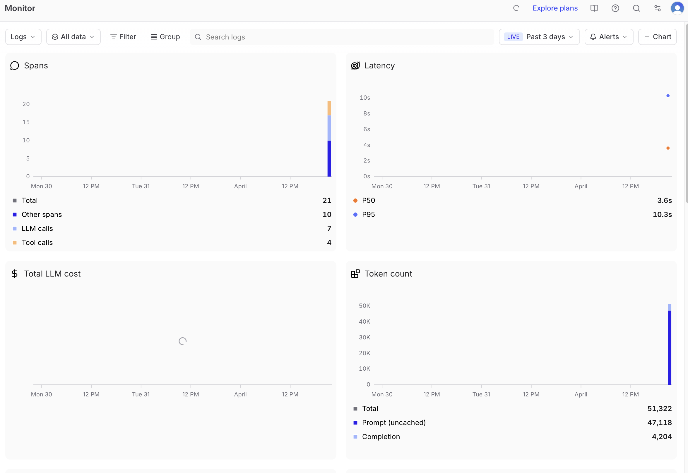

# Analysis of Braintrust dashboard exploration
Alison Manna

**What do you see in the traces (hierarchy of operations, spans, tool calls)?**

The dashboard shows 3 traces corresponding to the three questions I asked the agent with all  the same root span type, `invoke_agent (Strands Agents)`. In the first trace (for the question "What is the latest news about artificial intelligence?" query), the timeline view shows the agentic loop withthe top level containing `invoke_agent` which contains two sequential `execute_event_loop_cycle` spans. The first cycle has a `chat` span (the initial LLM call) followed immediately by an `execute_tool duckduckgo_search` span, which shows that the agent decided to search the internet before answering. The second cycle contains another `chat` span that takes in the the search results and then generates the final response to the user. So the pattern is as follows: the LLM reasons -> calls a tool -> reasons again but with the new context.

**What metrics are captured and what patterns you notice?**

Each `chat` span documents the start time, duration, offset (time from trace start), total tokens, prompt tokens, completion tokens, estimated cost, and  `gen_ai.server.time_to_first_token` (for example 1287ms on the first call). For all three traces the aggregate column headers show: 47,118 prompt tokens, 4,204 completion tokens, 51,322 total tokens, $0.068 total cost, and a p50 duration of 8.585s. A pattern I notied is a noteable asymmetry between prompt and completion tokens, namely that prompt tokens are dominant (at approx. 91% of total). However, this makes sense for an agent that performs a web search because it injects large chunks from the tool result into the context before generating a relatively concise final answer.

**Any interesting observations about performance, token usage, or behavior differences across your queries?**

An interesting behavioral difference is between the  two `chat` spans within trace #1. The first `chat` call lasted only 1.46 seconds and consumed 3408 tokens (3322 prompt, 86 completion). The model barely "spoke," it just decided to invoke `duckduckgo_search` and gave a brief tool-use JSON message. The second `chat` call took 5.53 seconds and 4582 tokens, which indicates a much larger context (search results injected into the prompt) and the longer generated answer. This shows that the length/verbosity and latency of the model's output increase in a way that correlates with the richness of the context. The Nobel Prize query (trace 2) appears to have required only a single direct search loop, while the AI news query (trace 1) triggered multiple `duckduckgo_search` calls within the second cycle (the agent mentioned finding some initial results but then produced a follow-up refined search). This would suggest that that more openended queries cause higher tool use and token consumption.

